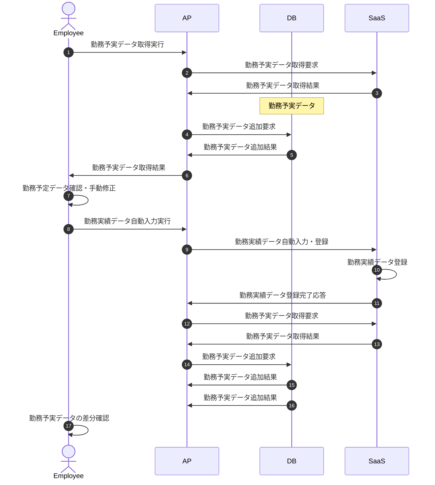

## 設計

### ステップ1

1. 業務フロー

```mermaid
sequenceDiagram
  autoNumber
  actor em as Employee
  participant ap as AP
  participant db as DB
  participant ss as SaaS
  em->>ap: 勤務予実データ取得実行
  ap->>ss: 勤務予実データ取得要求
  ss->>ap: 勤務予実データ取得結果
  Note over db: 勤務予実データ
  ap->>db: 勤務予実データ追加要求
  db->>ap: 勤務予実データ追加結果
  ap->>em: 勤務予実データ取得結果
  em->>em: 勤務予定データ確認・手動修正
  em->>ap: 勤務実績データ自動入力実行
  ap->>ss: 勤務実績データ自動入力・登録
  ss->>ss: 勤務実績データ登録
  ss->>ap: 勤務実績データ登録完了応答
  ap->>ss: 勤務予実データ取得要求
  ss->>ap: 勤務予実データ取得結果
  ap->>db: 勤務予実データ追加要求
  db->>ap: 勤務予実データ追加結果
  db->>ap: 勤務予実データ追加結果
  em->>em: 勤務予実データの差分確認
```

2. 画面遷移図

3. ワイヤーフレーム
