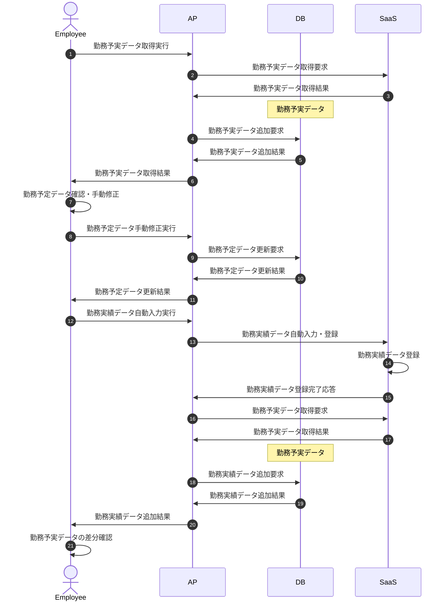
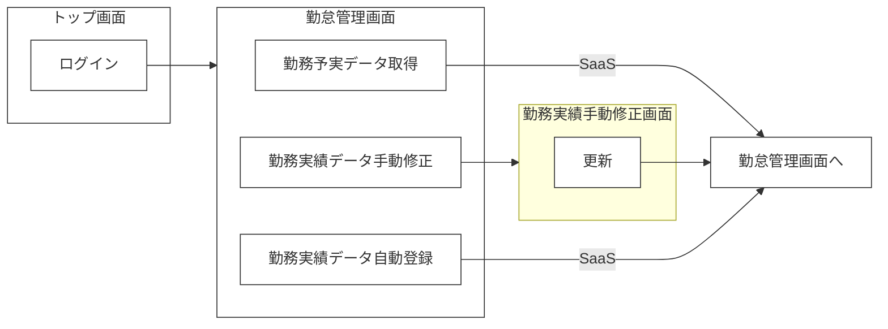
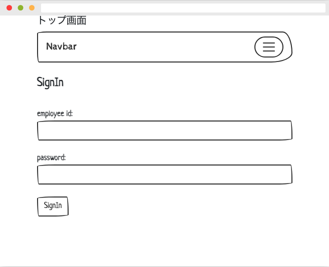
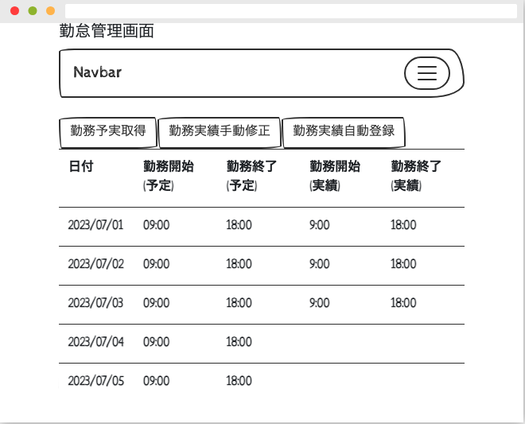
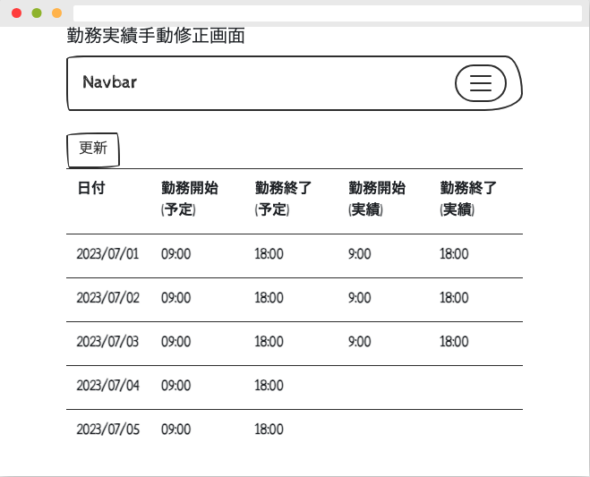
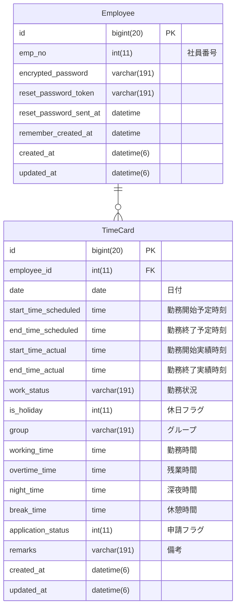
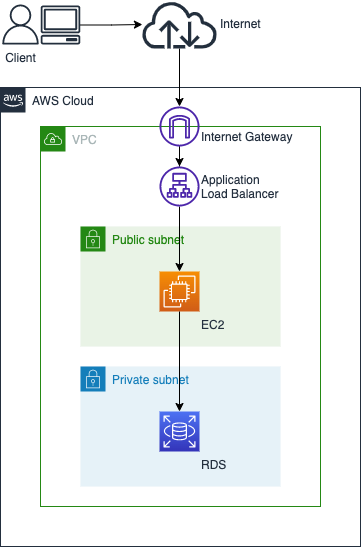

## 設計

### ステップ1

#### 1. 業務フロー

```mermaid
sequenceDiagram
  autoNumber
  actor em as Employee
  participant ap as AP
  participant db as DB
  participant ss as SaaS
  em->>ap: 勤務予実データ取得実行
  ap->>ss: 勤務予実データ取得要求
  ss->>ap: 勤務予実データ取得結果
  Note over db: 勤務予実データ
  ap->>db: 勤務予実データ追加要求
  db->>ap: 勤務予実データ追加結果
  ap->>em: 勤務予実データ取得結果
  em->>em: 勤務予定データ確認・手動修正
  em->>ap: 勤務予定データ手動修正実行
  ap->>db: 勤務予定データ更新要求
  db->>ap: 勤務予定データ更新結果
  ap->>em: 勤務予定データ更新結果
  em->>ap: 勤務実績データ自動入力実行
  ap->>ss: 勤務実績データ自動入力・登録
  ss->>ss: 勤務実績データ登録
  ss->>ap: 勤務実績データ登録完了応答
  ap->>ss: 勤務予実データ取得要求
  ss->>ap: 勤務予実データ取得結果
  Note over db: 勤務予実データ
  ap->>db: 勤務実績データ追加要求
  db->>ap: 勤務実績データ追加結果
  ap->>em: 勤務実績データ追加結果
  em->>em: 勤務予実データの差分確認
```

#### 2. 画面遷移図

```mermaid
graph LR
  %% スタイル
  classDef default fill: #fff, stroke: #333, stroke-width: 1px;
  style top fill: #fff,stroke: #333,stroke-width: 1px;
  style timeCards fill: #fff,stroke: #333,stroke-width: 1px;

  %% サブグラフ
  subgraph top [トップ画面]
    ログイン
    %% 新規登録
  end
  
  subgraph timeCards [勤怠管理画面]
    勤務予実データ取得
    勤務実績データ手動修正
    勤務実績データ自動登録
  end

  subgraph timeCardsUpdate [勤務実績手動修正画面]
    更新
  end
  
  %% アロー
  ログイン-->timeCards
  勤務実績データ手動修正-->timeCardsUpdate
  勤務予実データ取得--SaaS-->勤怠管理画面へ
  更新-->勤怠管理画面へ
  勤務実績データ自動登録--SaaS-->勤怠管理画面へ
```

#### 3. ワイヤーフレーム

### ステップ2

#### 1. ER図

```mermaid
erDiagram
  Employee ||--o{ TimeCard: ""

  Employee {
    id                      bigint(20)    PK  ""
    emp_no                  int(11)           "社員番号"
    encrypted_password      varchar(191)      ""
    reset_password_token    varchar(191)      ""
    reset_password_sent_at  datetime          ""
    remember_created_at     datetime          ""
    created_at              datetime(6)       ""
    updated_at              datetime(6)       ""
  }
  TimeCard {
    id                      bigint(20)    PK  ""
    employee_id             int(11)       FK  ""
    date                    date              "日付"
    start_time_scheduled    time              "勤務開始予定時刻"
    end_time_scheduled      time              "勤務終了予定時刻"
    start_time_actual       time              "勤務開始実績時刻"
    end_time_actual         time              "勤務終了実績時刻"
    work_status             varchar(191)      "勤務状況"
    is_holiday              int(11)           "休日フラグ"
    group                   varchar(191)      "グループ"
    working_time            time              "勤務時間"
    overtime_time           time              "残業時間"
    night_time              time              "深夜時間"
    break_time              time              "休憩時間"
    application_status      int(11)           "申請フラグ"
    remarks                 varchar(191)      "備考"
    created_at              datetime(6)       ""
    updated_at              datetime(6)       ""
  }
```

### ステップ3

#### 1. システム構成図

